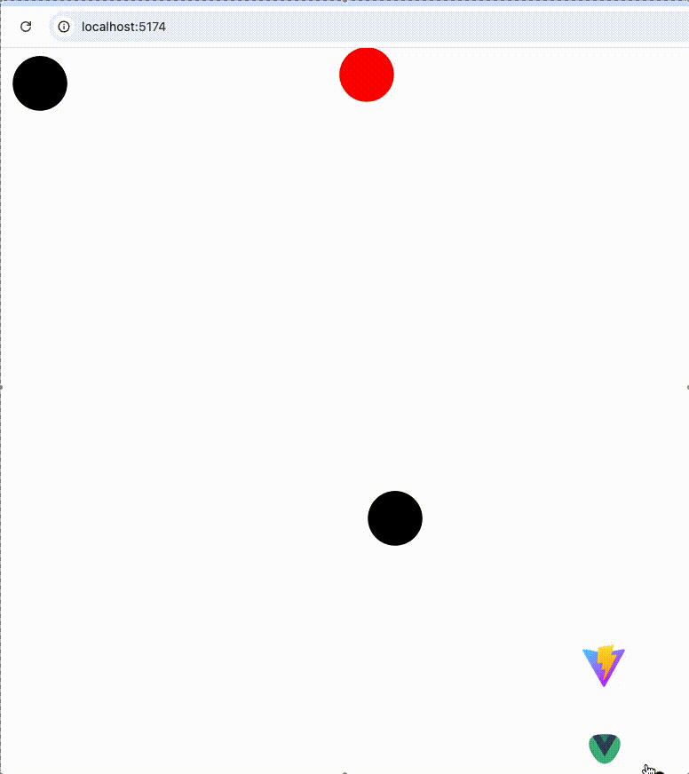

# Vue3 - Gooey Filter Sample

A very simple example of how to make an effect as if some elements have an attraction of matter.

how it works, in the container you have to put class `filter` and all that is inside will apply the effect
to the elements that you do not want to apply add classse `no-filter`.

## DEV

Install: `$ npm i`

Run: `$ npm run dev` or `$ npm run serve` 

